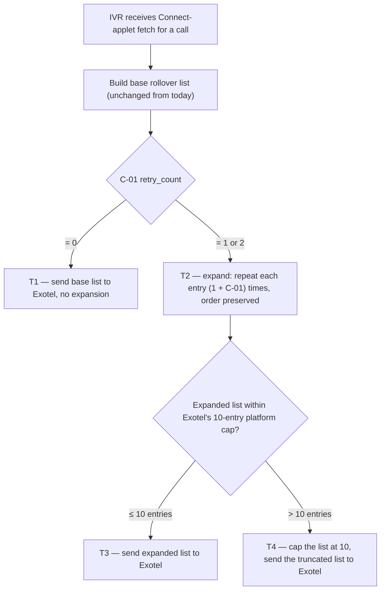

# IVR Retry Count — repeat the same number before rollover

| | | | |
|---|---|---|---|
| **Owner** — Ashish Raj (PM, IVR) | **Reviewer** — Rahul | **Status** — Draft | **Sign-off** — Pending |
| **Version** — v0.2 · 2026-09-08 | **Consulted — Exotel** — Tanay Puntambekar, Adnan C | **Consulted — Eng** — Rahul | |

---

## 1. Objective & Definition of Success

**Context.** This spec is an extension of the **IVR 2.0** feature (see §8). It applies only when the caller dials the **IVR masked number** to reach the callee — i.e., on the same call sessions that the multi-number rollover (Sept 2 release) already governs. Any call not initiated through the IVR masked number is untouched by this spec.

**Who is the caller.** For informational context only — caller eligibility is fully owned by IVR 2.0, not by this spec. IVR 2.0 admits three populations to the call flow that this spec extends:

- a **CSP user** (Owner, Manager or Technician) with an active Install / Restore / Pickup ticket,
- a **customer** with an active ticket of the same types, and
- a **PIN-authenticated caller** on any SIM (the colleague-forwarding / unregistered-SIM case), where PIN authentication proves association with a specific active ticket.

Whoever IVR 2.0 admits, this spec expands the same way. This spec does not add, remove or narrow that admission set — that stays IVR 2.0's business.

**Objective.** When a caller dials the IVR masked number to reach the callee and the callee does not pick up on the first ring, the same number is dialled again so the caller has a better chance of reaching them.

**Applies to every IVR 2.0 calling flow.** The retry expansion fires at a single point — the Connect-applet fetch — which is reached by all three IVR 2.0 calling paths: (i) **In-app CTA** — caller taps Call in the app, IVR resolves the destination via Table 1 cache hit; (ii) **Dialer callback, single active ticket** — caller dials the masked number, IVR's identification chain finds one active ticket and resolves the destination without a PIN prompt; (iii) **Dialer callback, PIN required** — caller dials the masked number, IVR prompts for a PIN (multi-ticket disambiguation or unknown caller), the PIN validates and the destination is resolved. In all three paths, the destination arrives at the Connect-applet fetch as a `numbers` array; this spec's expansion is applied identically in each case (AC-WF-1, AC-WF-2, AC-WF-3).

**Boundary.** This spec governs how many times the same number is dialled inside one call session on the IVR masked number — a single scalar (C-01). It leaves everything else unchanged: the list of distinct numbers the caller tries in rollover (Technician → Manager → Owner for customer-initiated; Customer primary → Customer alternate for CSP-initiated), the per-number ring time (30 s per Exotel default), and every other Connect-applet parameter. Non-IVR-masked-number call paths (direct dial, Call-Center / Trust-Line numbers, any legacy MN1/MN2 routing) are out of scope. If this ships and rollover order changes, that broke (AC-REG-1). If ring time changes, that broke (AC-REG-2).

### Guardrails — promises that hold on every path

| ID | Guardrail | One line | Anchors |
|---|---|---|---|
| G1 | **Same behaviour at C-01 = 0** | With retry disabled, each number in the rollover list is dialled exactly once — no duplicates in the numbers array, no extra dials. Identical to the pre-change flow. | R2 · AC-REG-1 · AC-CFG-1 · MQ-3 |
| G2 | **IVR 2.0 functionality preserved** | The existing IVR 2.0 flow — identification chain, PIN authentication, rollover order, Connect-applet contract, dead-end path, disposition webhook — continues to work exactly as it does today. This spec is a pure extension: it adds only the duplication step at Connect-applet fetch time; nothing else changes. | R1 · AC-REG-1 · AC-REG-2 · AC-GRD-1 · MQ-4 |

### Success metrics

| ID | Metric | Baseline | Target | Source |
|---|---|---|---|---|
| M1 | Call-level connect rate on IVR 2.0 — with retry_count = 1 | 51% *(pre-change, Sept 2 rollover state)* | ≥ 53% *(+2 pp lift toward the 55% non-IVR benchmark)* | MQ-1 |

**Invariant (not a metric):** G1 same-behaviour-at-zero deviations = 0, zero tolerance. Monitored via MQ-3, not trended.

---

## 2. User Stories & Rules

| ID | Story | MUST | MUST NOT |
|---|---|---|---|
| R1 | As a caller who dials the IVR masked number to reach a specific callee, I want the platform to try the same number more than once so I don't lose a call to a fumbled first ring. (Caller eligibility is IVR 2.0's — see §1 Context.) | **(a)** Dial the current number in the rollover list up to (1 + C-01) times before advancing to the next number. **(b)** Preserve rollover order — retries on number N complete before number N+1 is attempted. | Change the identity or count of the *distinct* numbers dialled in the rollover list — that is out of scope (§1 Boundary). |
| R2 | As IVR Ops, I want a single runtime-changeable knob for the retry count so I can turn the behaviour on, off, or up without a deploy. | **(a)** Expose retry count as a single parameter (C-01). **(b)** Setting it to 0 must produce a numbers array identical to today's (§1 Boundary, G1). | Require a service restart, code deploy, or coordination with Exotel to change the value. |

---

## 3. System Behaviour

Lifecycle of the **outbound dial list** (the `numbers` array returned to Exotel's Connect applet on each fetch). Neighbouring lifecycles — the call session on Exotel, per-number ring outcomes, and the missed-call notification cascade — are out of scope.

### 3a. System flow chart

**Precedence:** none — a Connect-applet fetch is one trigger with a linear evaluation chain. Concurrent fetches for different call sessions are independent; the C-01 value read is whichever value is live at fetch time (AC-CFG-1).

### 3b. State transition table — canon

| ID | From | Action / Trigger | Rule / Check | To | Side-effects |
|---|---|---|---|---|---|
| T1 | — | Connect-applet fetch received | C-01 = 0 | Sent (no-op expansion) | Base rollover list sent verbatim to Exotel. Behaviour is identical to today's flow. (R2b, G1) |
| T2 | — | Connect-applet fetch received | C-01 ∈ {1, 2} | Expanded | Each entry in the base list is repeated (1 + C-01) times, order preserved. Example: base = [A, B, C], C-01 = 1 → expanded = [A, A, B, B, C, C]. (R1a, R1b) |
| T3 | Expanded | List size ≤ 10 (Exotel platform cap) | — | Sent | Expanded list sent to Exotel as the Connect-applet response body. Exotel dials each entry in order per its documented behaviour. |
| T4 | Expanded | List size > 10 (Exotel platform cap) | — | Sent (capped) | List is truncated to the first 10 entries; the truncated list is sent to Exotel. Truncation removes the tail — earlier retries on higher-priority numbers are preserved over later retries on fallback numbers. |

---

## 4. Screen Requirements

**Experience intent:** none — this is a backend-only change. No screens are added, changed or removed by this spec.

The caller hears the same ring / hold experience that Exotel provides today; no in-call audio, no app UI, and no ops console changes are introduced.

---

## 5. Configurability

| ID | Parameter | Default | Range | Who changes it |
|---|---|---|---|---|
| C-01 | retry_count — number of extra times each entry in the rollover list is dialled before advancing to the next entry | **1** | 0, 1, or 2 | Product |

**Note on Exotel's 10-entry platform cap.** Exotel accepts at most 10 numbers per Connect-applet response — this is Exotel's platform limit, not a Wiom parameter. With the current rollover lists (up to 3 for customer-initiated, up to 2 for CSP-initiated), C-01 = 2 produces at most 9 entries, safely inside Exotel's cap. If the rollover list ever grows to 4 or more distinct numbers, the T4 truncation branch (§3b) protects the call by capping the sent array at 10.

---

## 6. Measurement

| ID | The system must be able to answer… | Feeds |
|---|---|---|
| MQ-1 | Call-level connect rate over a rolling window, split by the C-01 value in effect at call time (direction split — customer-initiated vs CSP-initiated — kept as a diagnostic cut). | M1 |
| MQ-2 | For calls that reached a bridged conversation, whether the successful connect came from the first attempt on a number or from a retry attempt on the same number. | Attribution for M1's lift — quantifies how much of the lift is retry-driven vs baseline. |
| MQ-3 | For every call, whether the numbers array sent to Exotel matched exactly what the pre-change flow would have produced when C-01 = 0. | G1 invariant |
| MQ-4 | For every call, whether the observable IVR 2.0 flow steps unrelated to the retry expansion — identification chain outcome, PIN authentication outcome, rollover order actually attempted, disposition webhook shape, dead-end path where applicable — match their pre-change behaviour. | G2 |

---

## 7. Acceptance Criteria

### DIAL — Rollout list expansion (T1, T2, T3, T4)

| AC | Given / When / Then | Verifies | Status |
|---|---|---|---|
| AC-DIAL-1 | **Given** C-01 = 1 (default) and a customer-initiated call whose base rollover list is `[9111111111, 9222222222, 9333333333]`, **When** the IVR receives the Connect-applet fetch, **Then** the numbers array sent to Exotel is exactly `[9111111111, 9111111111, 9222222222, 9222222222, 9333333333, 9333333333]` in that order. | R1a · R1b · T2 · T3 | Settled |
| AC-DIAL-2 | **Given** C-01 = 2 and a CSP-initiated call whose base list is `[8111111111, 8222222222]`, **When** the fetch is received, **Then** the numbers array sent is `[8111111111, 8111111111, 8111111111, 8222222222, 8222222222, 8222222222]`. | R1a · T2 · T3 | Settled |
| AC-DIAL-3 | **Given** C-01 = 1 and a base list with only one number `[9111111111]`, **When** the fetch is received, **Then** the numbers array sent is `[9111111111, 9111111111]`. | R1a · T2 · T3 | Settled |

### REG — Behaviour when disabled

| AC | Given / When / Then | Verifies | Status |
|---|---|---|---|
| AC-REG-1 | **Given** C-01 = 0, **When** the IVR receives a Connect-applet fetch for either direction, **Then** the numbers array sent to Exotel is byte-for-byte identical to what the pre-change flow would produce — same numbers, same order, same length, with each number appearing exactly once. | G1 · G2 · T1 · R2b | Settled |
| AC-REG-2 | **Given** any value of C-01 in the allowed range, **When** the fetch is received, **Then** the Connect-applet response body carries the same `max_ringing_duration` value (30 s, per Exotel default) that the pre-change flow returned — no other Connect-applet parameter is modified by this spec. | G2 | Settled |

### BV — Boundary values

| AC | Given / When / Then | Verifies | Status |
|---|---|---|---|
| AC-BV-1 | **Given** C-01 is set to 2 and a base list of 4 numbers `[A, B, C, D]` (hypothetical — no current flow produces this), **When** the fetch is received, **Then** the array sent to Exotel is `[A, A, A, B, B, B, C, C, C, D]` — truncated at Exotel's 10-entry platform cap. The last (`D`) loses its second and third retries. | T4 | Settled |
| AC-BV-2 | **Given** a base list of exactly 5 numbers and C-01 = 1, **When** the fetch is received, **Then** the array sent is exactly 10 entries — at Exotel's platform cap, no truncation. | T3 boundary | Settled |

### CFG — Configurability

| AC | Given / When / Then | Verifies | Status |
|---|---|---|---|
| AC-CFG-1 | **Given** C-01 = 1 and the first Connect-applet fetch for call A has been sent to Exotel, **When** an operator changes C-01 to 0 at runtime (no restart) and a second call B triggers a Connect-applet fetch, **Then** call B's numbers array is produced under C-01 = 0 (no duplicates); call A's ongoing dial sequence continues under the value read at its fetch time (C-01 = 1). | R2a · G1 · C-01 | Settled |

### GRD — Guardrail

| AC | Given / When / Then | Verifies | Status |
|---|---|---|---|
| AC-GRD-1 | **Given** C-01 = 1 and a call whose first number fails to pick up, **When** Exotel completes ring attempts on that number, **Then** Exotel proceeds to the *second entry in the sent array* — which is the same number retried — before advancing to the second distinct number in the base list, preserving the sequential rollover contract of IVR 2.0. | G2 · R1b · T3 | Settled |

### WF — Workflow (retry expansion across every IVR 2.0 calling flow)

Every IVR 2.0 calling flow reaches the Connect-applet fetch and must apply the expansion identically. One AC per flow, plus one end-to-end rollover journey.

| AC | Given / When / Then | Verifies | Status |
|---|---|---|---|
| AC-WF-1 | **Path 1 — In-app CTA.** **Given** C-01 = 1 and a customer with an active ticket taps the Call CTA in the app, causing IVR to resolve the destination via a Table 1 cache hit with the CSP's mobile `9211111111`, **When** IVR receives the Connect-applet fetch, **Then** the numbers array sent to Exotel is `[9211111111, 9211111111]` — the same number, dialled twice in sequence. | R1a · T2 · T3 · G2 | Settled |
| AC-WF-2 | **Path 2 — Dialer callback, single active ticket.** **Given** C-01 = 1 and a CSP user dials the IVR masked number from their phone's call log; IVR's identification chain matches them, finds exactly one active ticket, and resolves the destination to the customer's mobile `9322222222`, **When** IVR receives the Connect-applet fetch, **Then** the numbers array sent to Exotel is `[9322222222, 9322222222]`. | R1a · T2 · T3 · G2 | Settled |
| AC-WF-3 | **Path 3 / 4 — Dialer callback, PIN required.** **Given** C-01 = 1 and a caller dials the IVR masked number; IVR prompts for a PIN because the caller has multiple active tickets (Path 3) or is unknown to the identification chain (Path 4); the caller enters a valid PIN and the resolved destination is `[9433333333, 9433444444]` (a 2-number rollover list), **When** IVR receives the Connect-applet fetch that follows PIN validation, **Then** the numbers array sent to Exotel is `[9433333333, 9433333333, 9433444444, 9433444444]`. | R1a · R1b · T2 · T3 · G2 | Settled |
| AC-WF-4 | **End-to-end rollover.** **Given** C-01 = 1, a customer-initiated call reached via any of Paths 1–3, base list `[TechMobile, MgrMobile, OwnerMobile]`, **When** TechMobile does not pick up on the first attempt or its retry, and MgrMobile picks up on its first attempt, **Then** the call bridges to MgrMobile and the disposition webhook records legs in the order `TechMobile, TechMobile, MgrMobile`. | R1a · R1b · T2 · T3 · G2 | Settled |

---

## 8. Glossary

| Term | Meaning | Owner (domain) |
|---|---|---|
| IVR 2.0 | The parent feature this spec extends. IVR 2.0 introduced the single masked-number architecture with PIN-based authentication and multi-number rollover (Sept 2 2026). This spec adds the retry_count layer on top of that flow — same call sessions, same rollover list, same Connect-applet contract with Exotel. Anything IVR 2.0 does not govern is out of scope here. | IVR |
| IVR masked number | The single Wiom-owned DID that both customers and CSPs dial to reach each other through IVR 2.0. Every call session governed by this spec begins with a caller dialling this number. Calls made through any other channel (direct mobile-to-mobile, Call-Center number, Trust-Line number, legacy MN1/MN2) are outside this spec's scope. | IVR |
| Caller | The party who dials the IVR masked number to initiate a call session. Eligibility is owned by IVR 2.0 and is stated for context in §1 (CSP users, customers, and PIN-authenticated callers via colleague forwarding — all tied to an active Install / Restore / Pickup ticket). This spec does not constrain who counts as a caller. | IVR |
| Rollover list | **Canonical definition:** the ordered list of distinct phone numbers the IVR wants dialled on a single call session, before this spec's expansion is applied. For customer-initiated calls it is Technician → Manager → Owner (up to 3); for CSP-initiated calls it is Customer primary → Customer alternate (up to 2). Constructed by the existing IVR 2.0 flow — this spec does not change it. | IVR |
| Numbers array | The `numbers` array field in the JSON response sent to Exotel's Connect applet on each fetch. This spec's expansion (T2) is applied when building this array; the array is what Exotel actually dials. | IVR |
| Connect-applet fetch | The HTTP call Exotel makes to the IVR service for each call session to obtain the Connect-applet response (which includes the numbers array). Exotel's Passthru / Connect mechanism, per Exotel's documented API contract. | Exotel |
| retry_count | Shorthand for C-01. A single scalar (0, 1, or 2) meaning "how many *extra* times each rollover-list entry is dialled before advancing to the next entry." At 0, each number gets 1 attempt (today); at 1, each gets 2; at 2, each gets 3. | Product |

---

## 9. Notes for System Capabilities

What the platform must be able to do for this feature to exist. Whether these are one system or several, and how they interact, is the implementer's design.

| Capability | Needed by |
|---|---|
| Read a live-changeable scalar (C-01) at Connect-applet-fetch time without restart. | R2a · C-01 |
| Expand a rollover list by duplicating each entry (1 + C-01) times while preserving order. | T2 · R1a · R1b |
| Cap the expanded list at Exotel's 10-entry platform limit, truncating the tail if it exceeds. | T4 |
| Emit per-call telemetry that carries the C-01 value in effect at fetch time and reconstructs the numbers array actually sent. | MQ-1 · MQ-2 · MQ-3 |
| Attribute successful connects to either the first attempt on a number or a subsequent retry on the same number. | MQ-2 |

---

## AI-generated content for review

All previously flagged items resolved by PM in v0.2 review pass. Section retained empty as a marker; may be removed at finalise.

| Location | What was generated | Basis |
|---|---|---|
| — | — | (none) |
