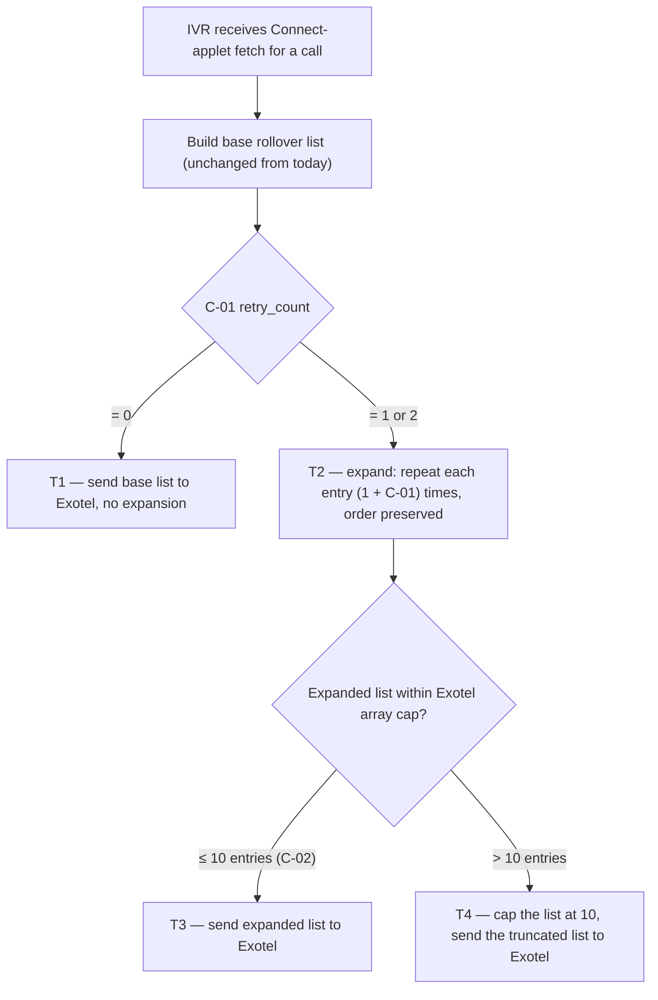

# IVR Retry Count — repeat the same number before rollover

| | | | |
|---|---|---|---|
| **Owner** — Ashish Raj (PM, IVR) | **Reviewer** — Eng Lead ⚠️ *AI GENERATED — review* | **Status** — Draft | **Sign-off** — Pending |
| **Version** — v0.1 · 2026-09-08 | **Consulted — Exotel** — Tanay Puntambekar, Adnan C | **Consulted — Eng** — TBD ⚠️ *AI GENERATED — review* | |

---

## 1. Objective & Definition of Success

**Context.** This spec is an extension of the **IVR 2.0** feature (see §8). It applies only when the caller dials the **IVR masked number** to reach the callee — i.e., on the same call sessions that the multi-number rollover (Sept 2 release) already governs. Any call not initiated through the IVR masked number is untouched by this spec.

**Objective.** When a caller dials the IVR masked number to reach the callee and the callee does not pick up on the first ring, the same number is dialled again so the caller has a better chance of reaching them.

**Boundary.** This spec governs how many times the same number is dialled inside one call session on the IVR masked number — a single scalar (C-01). It leaves everything else unchanged: the list of distinct numbers the caller tries in rollover (Technician → Manager → Owner for customer-initiated; Customer primary → Customer alternate for CSP-initiated), the per-number ring time (30 s per Exotel default), and every other Connect-applet parameter. Non-IVR-masked-number call paths (direct dial, Call-Center / Trust-Line numbers, any legacy MN1/MN2 routing) are out of scope. If this ships and rollover order changes, that broke (AC-REG-1). If ring time changes, that broke (AC-REG-2).

### Guardrails — promises that hold on every path

| ID | Guardrail | One line | Anchors |
|---|---|---|---|
| G1 | **Same behaviour at C-01 = 0** | With retry disabled, calls behave exactly as they did on 1 Sept — no duplicates in the numbers array, no extra dials. | R2 · AC-REG-1 · AC-CFG-1 · MQ-3 |
| G2 | **No user reaches a stopped state early** | Rollover to the next number in the list still happens after all retries on the current number are exhausted — never before. | R1 · T1 · AC-DIAL-1 |
| G3 | **Runtime-changeable, no deploy** | Retry count can be raised, lowered or zeroed at any time without a code release. | R2 · C-01 · AC-CFG-1 |

### Success metrics

| ID | Metric | Baseline | Target | Source |
|---|---|---|---|---|
| M1 | Call-level connect rate on IVR 2.0 — with retry_count = 1 | 51% ⚠️ *AI GENERATED — review* *(pre-change, Sept 2 rollover state)* | ≥ 53% ⚠️ *AI GENERATED — review* *(+2 pp lift toward the 55% non-IVR benchmark)* | MQ-1 |
| M2 | Customer-initiated connect rate | 48% ⚠️ *AI GENERATED — review* | ≥ 51% ⚠️ *AI GENERATED — review* | MQ-1 (customer-initiated slice) |
| M3 | CSP-initiated connect rate | 53% ⚠️ *AI GENERATED — review* | ≥ 54% ⚠️ *AI GENERATED — review* | MQ-1 (CSP-initiated slice) |

**Invariant (not a metric):** G1 same-behaviour-at-zero deviations = 0, zero tolerance. Monitored via MQ-3, not trended.

---

## 2. User Stories & Rules

| ID | Story | MUST | MUST NOT |
|---|---|---|---|
| R1 | As a caller who dials the masked IVR number to reach a specific callee, I want the platform to try the same number more than once so I don't lose a call to a fumbled first ring. | **(a)** Dial the current number in the rollover list up to (1 + C-01) times before advancing to the next number. **(b)** Preserve rollover order — retries on number N complete before number N+1 is attempted. | Change the identity or count of the *distinct* numbers dialled in the rollover list — that is out of scope (§1 Boundary). |
| R2 | As IVR Ops, I want a single runtime-changeable knob for the retry count so I can turn the behaviour on, off, or up without a deploy. | **(a)** Expose retry count as a single parameter (C-01). **(b)** Setting it to 0 must produce a numbers array identical to today's (§1 Boundary, G1). | Require a service restart, code deploy, or coordination with Exotel to change the value. |

---

## 3. System Behaviour

Lifecycle of the **outbound dial list** (the `numbers` array returned to Exotel's Connect applet on each fetch). Neighbouring lifecycles — the call session on Exotel, per-number ring outcomes, and the missed-call notification cascade — are out of scope.

### 3a. System flow chart

**Precedence:** none — a Connect-applet fetch is one trigger with a linear evaluation chain. Concurrent fetches for different call sessions are independent; the C-01 value read is whichever value is live at fetch time (AC-CFG-1).

### 3b. State transition table — canon

| ID | From | Action / Trigger | Rule / Check | To | Side-effects |
|---|---|---|---|---|---|
| T1 | — | Connect-applet fetch received | C-01 = 0 | Sent (no-op expansion) | Base rollover list sent verbatim to Exotel. Behaviour is identical to today's flow. (R2b, G1) |
| T2 | — | Connect-applet fetch received | C-01 ∈ {1, 2} | Expanded | Each entry in the base list is repeated (1 + C-01) times, order preserved. Example: base = [A, B, C], C-01 = 1 → expanded = [A, A, B, B, C, C]. (R1a, R1b) |
| T3 | Expanded | List size ≤ 10 (C-02) | — | Sent | Expanded list sent to Exotel as the Connect-applet response body. Exotel dials each entry in order per its documented behaviour. |
| T4 | Expanded | List size > 10 (C-02) | — | Sent (capped) | List is truncated to the first 10 entries; the truncated list is sent to Exotel. Truncation removes the tail — earlier retries on higher-priority numbers are preserved over later retries on fallback numbers. |

---

## 4. Screen Requirements

**Experience intent:** none — this is a backend-only change. No screens are added, changed or removed by this spec.

The caller hears the same ring / hold experience that Exotel provides today; no in-call audio, no app UI, and no ops console changes are introduced.

---

## 5. Configurability

| ID | Parameter | Default | Range | Who changes it |
|---|---|---|---|---|
| C-01 | retry_count — number of extra times each entry in the rollover list is dialled before advancing to the next entry | **1** | 0, 1, or 2 | Product ⚠️ *AI GENERATED — review* |
| C-02 | Maximum size of the numbers array sent to Exotel — the cap Exotel enforces on the Connect-applet response | 10 | Fixed at 10 by Exotel (see §8) | Exotel — not customer-changeable |

**Interaction note (C-01 × C-02):** with a full 3-number rollover list, C-01 = 2 would produce 9 entries — within cap. With a hypothetical 4-number list, C-01 = 2 would produce 12 entries and T4 truncation would fire, dropping the last (lowest-priority) entry's third retry first. This is why the current rollout lists (max 3 for customer-initiated, max 2 for CSP-initiated) fit within the cap at every allowed C-01 value.

---

## 6. Measurement

| ID | The system must be able to answer… | Feeds |
|---|---|---|
| MQ-1 | Call-level connect rate over a rolling window, split by direction (customer-initiated / CSP-initiated) and by the C-01 value in effect at call time. | M1 · M2 · M3 |
| MQ-2 | For calls that reached a bridged conversation, whether the successful connect came from the first attempt on a number or from a retry attempt on the same number. | Attribution for M1's lift — quantifies how much of the lift is retry-driven vs baseline. |
| MQ-3 | For every call, whether the numbers array sent to Exotel matched exactly what the pre-change flow would have produced when C-01 = 0. | G1 invariant |

---

## 7. Acceptance Criteria

### DIAL — Rollout list expansion (T1, T2, T3, T4)

| AC | Given / When / Then | Verifies | Status |
|---|---|---|---|
| AC-DIAL-1 | **Given** C-01 = 1 (default) and a customer-initiated call whose base rollover list is `[9111111111, 9222222222, 9333333333]`, **When** the IVR receives the Connect-applet fetch, **Then** the numbers array sent to Exotel is exactly `[9111111111, 9111111111, 9222222222, 9222222222, 9333333333, 9333333333]` in that order. | R1a · R1b · T2 · T3 | Settled |
| AC-DIAL-2 | **Given** C-01 = 2 and a CSP-initiated call whose base list is `[8111111111, 8222222222]`, **When** the fetch is received, **Then** the numbers array sent is `[8111111111, 8111111111, 8111111111, 8222222222, 8222222222, 8222222222]`. | R1a · T2 · T3 | Settled |
| AC-DIAL-3 | **Given** C-01 = 1 and a base list with only one number `[9111111111]`, **When** the fetch is received, **Then** the numbers array sent is `[9111111111, 9111111111]`. | R1a · T2 · T3 | Settled |

### REG — Behaviour when disabled

| AC | Given / When / Then | Verifies | Status |
|---|---|---|---|
| AC-REG-1 | **Given** C-01 = 0, **When** the IVR receives a Connect-applet fetch for either direction, **Then** the numbers array sent to Exotel is byte-for-byte identical to what the pre-change flow (state on 1 Sept 2026) would have produced — same numbers, same order, same length. | G1 · T1 · R2b | Settled |
| AC-REG-2 | **Given** any value of C-01, **When** the fetch is received, **Then** the per-number ring time returned to Exotel (`max_ringing_duration`) is unchanged from today. | §1 Boundary | Settled |

### BV — Boundary values

| AC | Given / When / Then | Verifies | Status |
|---|---|---|---|
| AC-BV-1 | **Given** C-01 is set to 2 and a base list of 4 numbers `[A, B, C, D]` (hypothetical — no current flow produces this), **When** the fetch is received, **Then** the array sent to Exotel is `[A, A, A, B, B, B, C, C, C, D]` — truncated at 10 entries (C-02). The last (`D`) loses its second and third retries. | T4 · C-02 | Settled |
| AC-BV-2 | **Given** a base list of exactly 5 numbers and C-01 = 1, **When** the fetch is received, **Then** the array sent is exactly 10 entries — at the cap, no truncation. | T3 boundary at C-02 | Settled |

### CFG — Configurability

| AC | Given / When / Then | Verifies | Status |
|---|---|---|---|
| AC-CFG-1 | **Given** C-01 = 1 and the first Connect-applet fetch for call A has been sent to Exotel, **When** an operator changes C-01 to 0 at runtime (no restart) and a second call B triggers a Connect-applet fetch, **Then** call B's numbers array is produced under C-01 = 0 (no duplicates); call A's ongoing dial sequence continues under the value read at its fetch time (C-01 = 1). | R2a · G3 · C-01 | Settled |
| AC-CFG-2 | **Given** C-01 is set to an out-of-range value (e.g. 3 or -1), **When** the fetch is received, **Then** the IVR clamps to the nearest in-range value (0 or 2 respectively) and continues processing — the call is not failed. | Value hygiene on C-01 ⚠️ *AI GENERATED — review* | Settled |

### GRD — Guardrail

| AC | Given / When / Then | Verifies | Status |
|---|---|---|---|
| AC-GRD-1 | **Given** C-01 = 1 and a call whose first number fails to pick up, **When** Exotel completes ring attempts on that number, **Then** Exotel proceeds to the *second entry in the sent array* — which is the same number retried — before advancing to the second distinct number in the base list. | G2 · R1b · T3 | Settled |

### WF — Workflow

| AC | Given / When / Then | Verifies | Status |
|---|---|---|---|
| AC-WF-1 | **Given** C-01 = 1, a customer-initiated call, base list `[TechMobile, MgrMobile, OwnerMobile]`, **When** TechMobile does not pick up on the first attempt or its retry, and MgrMobile picks up on its first attempt, **Then** the call bridges to MgrMobile and the disposition webhook records legs in the order `TechMobile, TechMobile, MgrMobile`. | R1a · R1b · T2 · T3 · G2 | Settled |

---

## 8. Glossary

| Term | Meaning | Owner (domain) |
|---|---|---|
| IVR 2.0 | The parent feature this spec extends. IVR 2.0 introduced the single masked-number architecture with PIN-based authentication and multi-number rollover (Sept 2 2026). This spec adds the retry_count layer on top of that flow — same call sessions, same rollover list, same Connect-applet contract with Exotel. Anything IVR 2.0 does not govern is out of scope here. | IVR |
| IVR masked number | The single Wiom-owned DID that both customers and CSPs dial to reach each other through IVR 2.0. Every call session governed by this spec begins with a caller dialling this number. Calls made through any other channel (direct mobile-to-mobile, Call-Center number, Trust-Line number, legacy MN1/MN2) are outside this spec's scope. | IVR |
| Rollover list | **Canonical definition:** the ordered list of distinct phone numbers the IVR wants dialled on a single call session, before this spec's expansion is applied. For customer-initiated calls it is Technician → Manager → Owner (up to 3); for CSP-initiated calls it is Customer primary → Customer alternate (up to 2). Constructed by the existing IVR 2.0 flow — this spec does not change it. | IVR |
| Numbers array | The `numbers` array field in the JSON response sent to Exotel's Connect applet on each fetch. This spec's expansion (T2) is applied when building this array; the array is what Exotel actually dials. | IVR |
| Connect-applet fetch | The HTTP call Exotel makes to the IVR service for each call session to obtain the Connect-applet response (which includes the numbers array). Exotel's Passthru / Connect mechanism, per Exotel's documented API contract. | Exotel |
| retry_count | Shorthand for C-01. A single scalar (0, 1, or 2) meaning "how many *extra* times each rollover-list entry is dialled before advancing to the next entry." At 0, each number gets 1 attempt (today); at 1, each gets 2; at 2, each gets 3. | Product |

---

## 9. Notes for System Capabilities

What the platform must be able to do for this feature to exist. Whether these are one system or several, and how they interact, is the implementer's design.

| Capability | Needed by |
|---|---|
| Read a live-changeable scalar (C-01) at Connect-applet-fetch time without restart. | R2a · G3 · C-01 |
| Expand a rollover list by duplicating each entry (1 + C-01) times while preserving order. | T2 · R1a · R1b |
| Cap the expanded list at C-02 entries, truncating the tail if it exceeds. | T4 · C-02 |
| Emit per-call telemetry that carries the C-01 value in effect at fetch time and reconstructs the numbers array actually sent. | MQ-1 · MQ-2 · MQ-3 |
| Attribute successful connects to either the first attempt on a number or a subsequent retry on the same number. | MQ-2 |

---

## AI-generated content for review

| Location | What was generated | Basis |
|---|---|---|
| Header · Reviewer | "Eng Lead" placeholder | No reviewer named yet — needs assignment |
| Header · Consulted — Eng | Marked TBD | Same as above |
| §1 M1 baseline (51%) and target (≥ 53%) | Baseline taken from PM's earlier Sept 2 rollover update ("~51%"); target set as a modest +2 pp lift toward the 55% non-IVR benchmark | Inferred from the earlier email thread numbers; PM to confirm the exact target |
| §1 M2 baseline (48%) and target (≥ 51%) | Same source and inference as M1 | Confirm |
| §1 M3 baseline (53%) and target (≥ 54%) | Same source and inference | Confirm — CSP-initiated is already above non-IVR benchmark of 52%, so target may need PM re-think |
| §5 C-01 owner (Product) | Default owner for a product-behaviour knob | Confirm |
| §7 AC-CFG-2 (out-of-range clamping) | Added as a safety AC — the value hygiene isn't in the PM's brief but is required behaviour if a runtime knob is exposed | Confirm the clamping direction (clamp vs reject vs fallback to default) |
